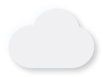
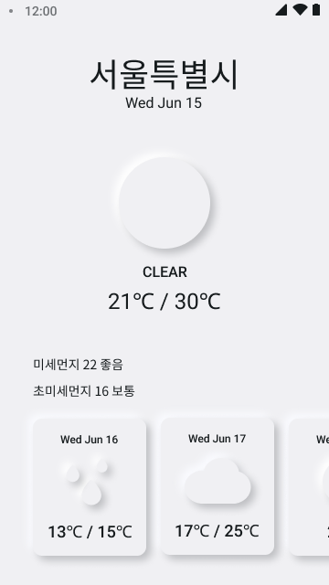
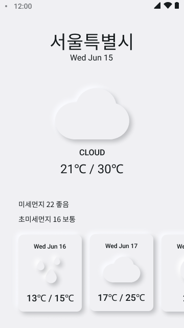
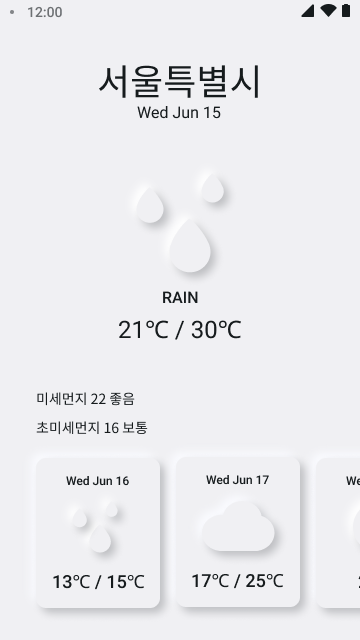
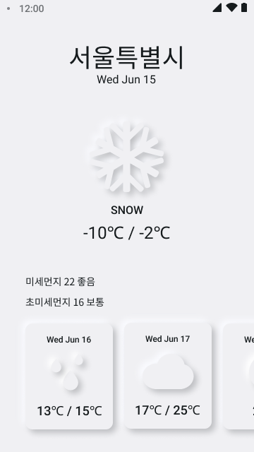

 
 
 
 

  

 
 
 
 
  
# ☁ 오늘, 날씨 소개
사용자의 현재 위치에 따른 일주일 날씨 정보 및 
미세먼지, 초미세먼지 정보를 제공하는 날씨 정보 어플입니다. 
React Native를 활용하여 제작되었으며, 구글 플레이 스토어 업로드 예정입니다.
 
 

# ✏ Skills
React Native, Axios

 
 

# 👀 Demo

    
    
    
    

 
 

# 🎨 Figma(Design)
https://www.figma.com/file/4tsl9FwTVpqb0GERl41Scn/Weather-App?node-id=0%3A1

 
 

# 📆 제작기간
2022년 07월